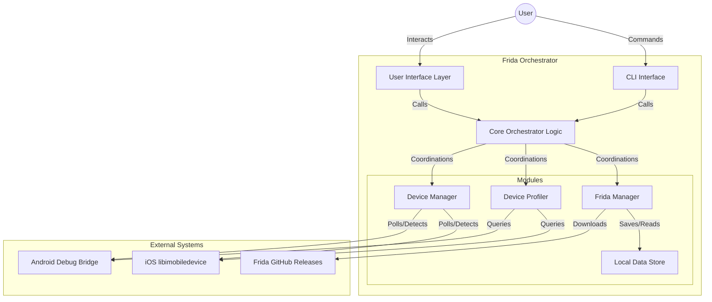
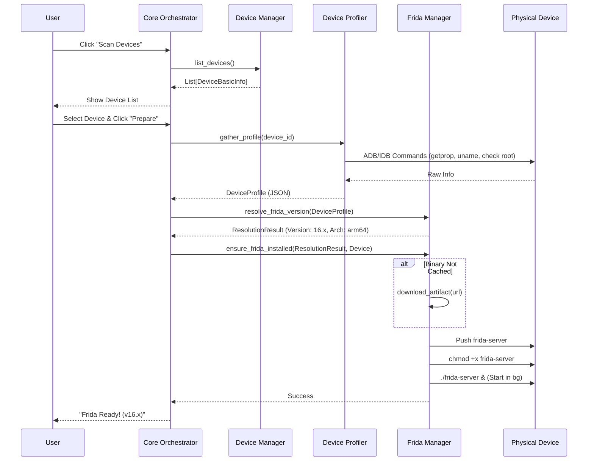

# Frida Orchestrator - Architecture Design

## High-Level System Architecture

The **Frida Orchestrator** is designed as a modular, local-first desktop application. It explicitly separates the core logic (Device & Frida management) from the User Interface, allowing for a "CLI-first" approach where the GUI is just a consumer of the core libraries.

## Module Responsibilities

| Module | Responsibility |
| :--- | :--- |
| **Core Orchestrator** | Acts as the central controller. It receives commands from the UI/CLI, coordinates the workflow (Scan -> Profile -> Prepare), and manages the overall application state. |
| **Device Manager** | Responsible for detecting connected devices. Wraps `adb` for Android and `idevice_id`/`ideviceinfo` for iOS. It standardizes connection events into a common `Device` object. |
| **Device Profiler** | Once a device is detected, this module deeply inspects it. It runs commands to fetch OS version, CPU architecture (ABI), and detects Root/Jailbreak status. It produces a `DeviceProfile` JSON. |
| **Frida Manager** | The brain of the operation. It holds the "Compatibility Matrix". It takes a `DeviceProfile` as input and determines the correct Frida version and artifact (e.g., `frida-server-16.1.4-android-arm64`). It manages the downloading (caching) and installation of these binaries. |
| **Local Data Store** | A simple file-system based storage for caching downloaded Frida binaries and storing tool configuration (compatibility matrices, user preferences). |

## Data Flow: "Prepare Environment"

This is the primary workflow of the application.

## Technology Stack Justification

*   **Language: Python 3.10+**
    *   **Reason:** Excellent library support for task automation, scripting, and interaction with system binaries (`subprocess`). Great support for CLI creation (`argparse`, `click`, `rich`).
*   **Android Interaction: `pure-python-adb` or subprocess `adb`**
    *   **Reason:** While pure python libraries exist, wrapping the native `adb` binary via `subprocess` is often more robust and aligns with the "tooling engineer" mindset where the user likely has platform tools installed. *Decision: Subprocess wrapper for maximum compatibility.*
*   **iOS Interaction: `libimobiledevice` (via `subprocess`)**
    *   **Reason:** Standard open-source toolchain for iOS without Xcode.
*   **GUI: TBD (Wrapper)**
    *   **Reason:** The core requirements emphasize a "CLI-first" design. The GUI can be built later using PySide6 (Qt) or a web-based local UI, but the logic remains decoupled.

## Security & Ethics Design

*   **Explicit Consent:** No action (like pushing files) happens without an explicit function call initiated by a user command.
*   **Local Caching:** Binaries are downloaded to a user-owned directory vs system temp to avoid tampering.
*   **Checksum Validation:** When possible, verify SHA256 of downloaded Frida releases.
